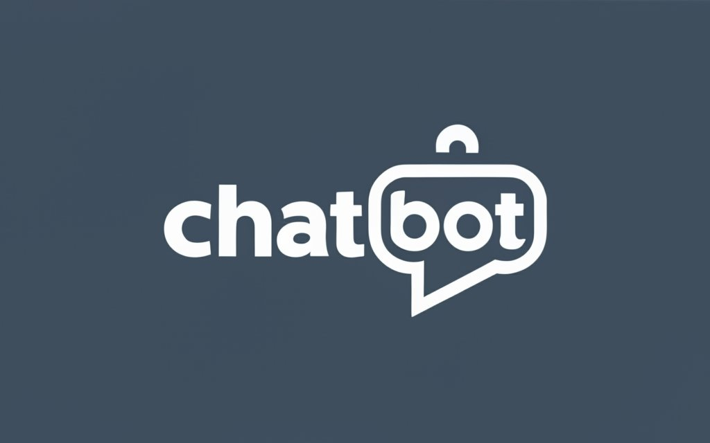

  

## Introduction

This project integrates two main components: a Flask-based API and a Streamlit ChatBot. The Flask API is designed to facilitate interactions between the application and a MongoDB NoSQL database. It is containerized using Docker and deployed on a Synology DS224+ as a Docker container, with a tunnel established to Ngrok for external access. The ChatBot, developed using Streamlit, interacts with the user and the API, offering advanced features like RAG and Q&A models, feedback systems, and integration with various AI technologies.

## Technologies and Tools

- **[Python](https://www.python.org/)**: Primary language for both backend and frontend.
- **[Flask](https://flask.palletsprojects.com/en/2.0.x/)**: Micro web framework for the API.
- **[MongoDB](https://www.mongodb.com/)**: NoSQL database for storing data and vector embeddings.
- **[JWT (JSON Web Tokens)](https://jwt.io/)**: For secure API communication.
- **[Streamlit](https://streamlit.io/)**: For creating the ChatBot web app.
- **[OpenAI](https://openai.com/)**: Utilizing GPT-3.5 Turbo and GPT-3.5 Finetuned models.
- **[Mistral-7B](https://huggingface.co/TheBloke/Mistral-7B-Instruct-v0.1-GGUF)**: OpenSource Model for Q&A and Chatbot.
- **[Helicone](https://helicone.ai/)**: For feedback on chatbot responses.
- **[Lakera](https://lakera.ai/)**: For detecting inappropriate messages.
- **[Llama-Index](https://docs.llamaindex.ai/en/stable/)**: For creating document embeddings.
- **[Langchain](https://python.langchain.com/docs/get_started/introduction)**: For creating word embeddings.
- **[Streamlit-Echarts](https://github.com/andfanilo/streamlit-echarts)**: For visualizing data using Apache ECharts.

## Key Features

- **API with Flask**: Containerized and deployed for database interaction.
- **ChatBot with Streamlit**: Interactive user interface with AI-driven responses.
- **Data Handling**: Preparation and automatic connection scripts for training and fine-tuning.
- **Advanced Analytics**: Incorporating Streamlit-Echarts for graphical data representation.
- **Security and Feedback**: Using Helicone and Lakera for user interaction safety and response improvement.
- **Enhanced Chatting**: Utilizing AI models for dynamic and context-aware chatting experiences.
